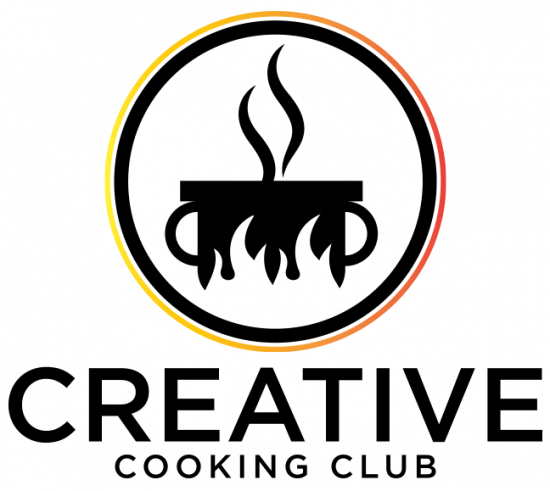

  

## Creative Cooking Club

We are the **Creative Cooking Club team**. 

We are a team of three students of UC Berkeley’s [Master in Information and Data Science program](https://www.ischool.berkeley.edu/projects/2020/creative-cooking-club). As our final project we tackled the problem of cooking. 

We think that cooking is a difficult optimization problem. Given ingredients I have or can buy, what can I cook which is low effort and which I or the persons I cook for like to eat? 

We want to help in reducing this mental load by using modern Machine Learning techniques. By doing so, we want to help to reduce wasting food in the fridge, support a more healthy diet and bring back joy in making your own food.

Our final project is a personalized recipe recommendation app powered by ingredient availability optimization and machine vision to make at-home cooking tasty, easy, and enjoyable while reducing food waste. The app will be available for download on the iPhone in summer 2020. 

The app is called **Creative Cooking Club**. 

*The project is done for academic merits only and is not a commercial product or venture.*

You can visit us on our website [creative-cooking.club](https://www.creative-cooking.club/).

This repository contains all the code we were writing for our application. The structure of the repository is outlined in *Structure*.

The data is derived from different sources listed in *Data Sources*.

The approaches we used build on the available literature in ingredients image detections, inference of recipe closeness, and user-recipe-preference matching. The sources of the literature are listed in the section *Literature*.

Finally, our approaches are explained and evaluated in our Google slide deck [Creative Cooking App](https://docs.google.com/presentation/d/1Srjhf28hi3QJZ-fJAD0IVu0_gLrK8uXcIUSNgeqtJh4/edit?usp=sharing). The slides also give an overview on the infrastructure set-up we are using.

Enjoy!

**The Creative Cooking Team**
Michael Berger
Andre Fernandes
Eddie Zhu

## Structure

The repository is structured into six different folders.

*   **user-preference-matching** contains all code and results from clustering users in nine distinct profiles using hierarchical clustering amd training our user-recipe-preference matching model, a multi-layer Neural Network trained on predicting the ratings per recipe for each profile.

*   **ingredients-image-detection** contains all code which we used to download ingredients image data, clean it and train different model architectures. Our final model was trained using the Google Cloud Vision API. The model file is saved in this folder.

*   **ingredients-word-embeddings** contains all code which was used to explore ingredients swapping based on ingredients closeness. Amongst other approaches, we trained our own word2vec embeddings on recipe data in order to infere ingredients closeness.

*   **cluster-analysis** contains all code which was used to build our decision tree model in order to classify users into the nine different profiles in a user onboarding process as quickly and conveniently as possible and also includes the code to infer recipe closeness. Amongst other approaches we used Latent Semantic Indexing in order to derive the closeness of recipes by using Euclidean Distance. This is an important part of the personalization of teh user-recipe-matching model, as we use this approach to penalize or reward recipes which are too close to a predicted target recipe or are "close enough" respectively.

*   **app-files** contains all the code we used for building the app.

*   **logos** contains two of the three logos which were created by the designer *Logoflow* for our project.

## Data Sources

We used the following data sources:

*   [Food.com Recipes and Interactions](https://www.kaggle.com/shuyangli94/food-com-recipes-and-user-interactions) created by Majumder et al.
*   [Grocery Store Dataset](https://github.com/marcusklasson/GroceryStoreDataset) created by Klasson et al.
*   [Freiburg Grocery Dataset](https://github.com/PhilJd/freiburg_groceries_dataset) created by Jund et al.
*   [Fruit Images](https://github.com/Horea94/Fruit-Images-Dataset) created by Muresan et al.
*   *100 images scraped from Google Images per ingredient category*
*   *100 images scraped from Baidu Images per ingredient category*

We cited sources where we reused code from other authors in the comments in the code files.

## Literature Sources

We based our analysis on the following literature.

*   Horea Muresan, Mihai Oltean, Fruit recognition from images using deep learning, Acta Univ. Sapientiae, Informatica Vol. 10, Issue 1, pp. 26-42, 2018.
*   Swan Dekkers, 2017: Training a 2-layer Neural Network model to swap ingredients based on cosine similarity. Master Thesis.
*   Majumder et al. (2019): Generating Personalized Recipes from Historical User Preferences, in: EMNLP/IJCNLP.
*   Kazama et al (2018): A neural network system for transformation of regional cuisine style, in: Frontiers in ICT, vol. 5, no. 14.
*   Carvalho et al. (2018): Cross-Modal Retrieval in the Cooking Context: Learning Semantic Text-Image Embeddings, Conference Paper, 41st International ACM SIGIR Conference on Research and Development in Information Retrieval.

Our logo was created by the designer *Logoflow* via the platform [fiverr](https://www.fiverr.com).
